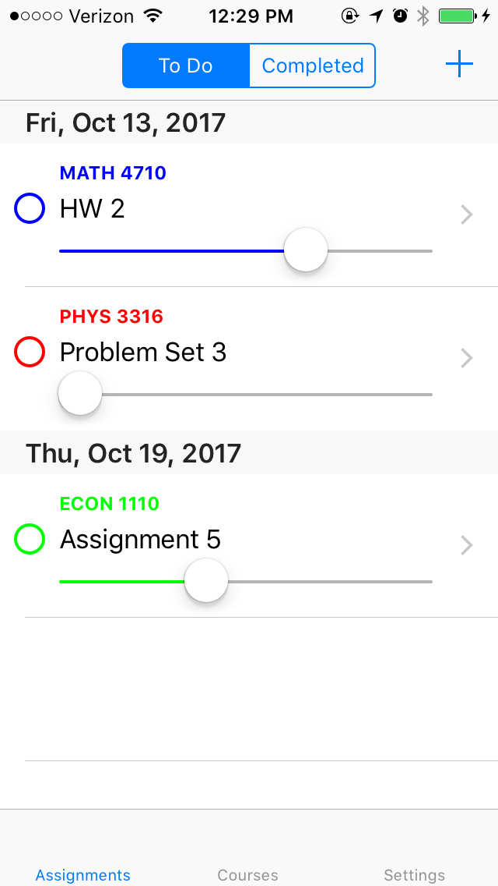

# Homework Planner

This was my final project for CS 2048: Introduction to iOS App Development. It is a homework planner app designed to keep you on top of your assignments for each course you are taking. Homework Planner tracks your progress on assignments and notifies you of upcoming deadlines.

  